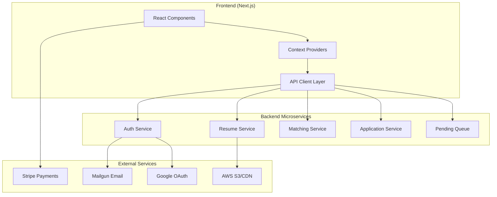
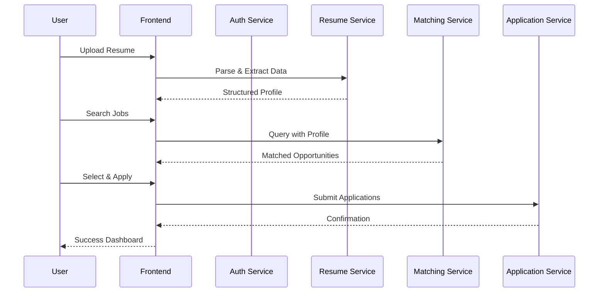
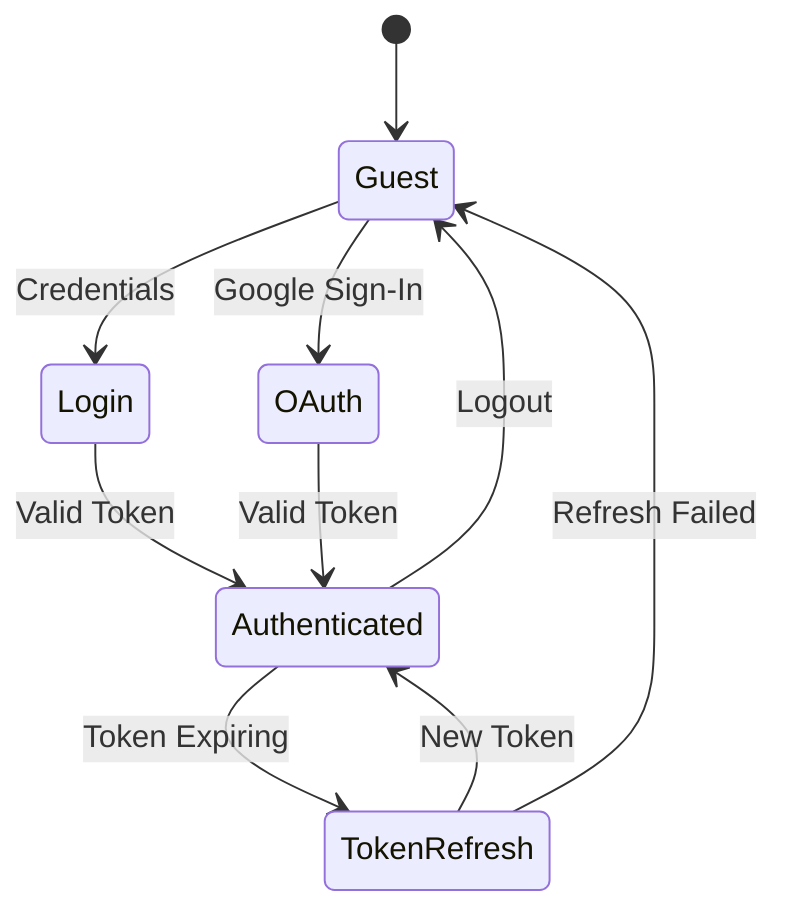

<div align="center">

# AI Job Application Platform

### Intelligent Automation for Your Career

[](https://nextjs.org/)
[](https://reactjs.org/)
[](https://www.typescriptlang.org/)
[](https://tailwindcss.com/)
[](https://stripe.com/)

<br />

**Stop applying manually. Start getting interviews.**

[Getting Started](#-quick-start) · [Architecture](#-architecture) · [Tech Stack](#-tech-stack) · [Deployment](#-deployment)

</div>

---

## Overview

A next-generation job application platform that leverages AI to automate the entire job hunting process. From intelligent job matching to tailored resume generation and automated application submission — all in one seamless experience.

```
Upload Resume → AI Matching → Tailored Applications → Auto-Submit → Get Interviews
```

---

## ✨ Features

| Feature | Description |
|---------|-------------|
| **AI-Powered Matching** | Smart algorithms match your profile with relevant opportunities from 100K+ sources |
| **Resume Tailoring** | Automatically customizes your resume for each application |
| **Cover Letter Generation** | AI-crafted cover letters that speak to each role |
| **One-Click Apply** | Submit hundreds of applications with a single click |
| **Application Tracking** | Real-time dashboard to monitor all your applications |
| **Interview Prep** | Built-in tools to prepare for upcoming interviews |

---

## 🏗 Architecture



### Application Flow



---

## 🛠 Tech Stack

<table>
<tr>
<td valign="top" width="33%">

### Frontend


</td>
<td valign="top" width="33%">

### UI Components


</td>
<td valign="top" width="33%">

### Integrations


</td>
</tr>
</table>

### Core Dependencies

| Category | Technologies |
|----------|-------------|
| **Framework** | Next.js 14 (App Router), React 18, TypeScript 5.4 |
| **Styling** | Tailwind CSS 3.4, DaisyUI 4.10, CSS Variables |
| **State** | React Context API, React Hook Form, Zod Validation |
| **UI** | Radix UI Primitives, Headless UI, Motion (Framer) |
| **Data** | Axios, TanStack Table, JWT Authentication |
| **Payments** | Stripe (Checkout, Subscriptions, Webhooks) |

---

## 🚀 Quick Start

### Prerequisites

- Node.js 22+
- npm or yarn
- Docker (optional)

### Installation

```bash
# Clone the repository
git clone https://github.com/AIgen-Solutions-s-r-l/ai-job-application-frontend.git
cd ai-job-application-frontend

# Install dependencies
npm install

# Set up environment variables
cp .env.example .env.local

# Start development server
npm run dev
```

### Available Scripts

| Command | Description |
|---------|-------------|
| `npm run dev` | Start development server |
| `npm run build` | Build for production |
| `npm run start` | Start production server |
| `npm run lint` | Run ESLint |
| `npm run check-types` | TypeScript type checking |
| `npm run docker:build` | Build Docker image |
| `npm run docker:start` | Run in Docker container |

---

## ⚙️ Configuration

### Environment Variables

```bash
# App Configuration
NEXT_PUBLIC_APP_NAME="Your App Name"
NEXT_PUBLIC_APP_DESCRIPTION="Your app description"
SITE_URL="https://yourdomain.com"

# Authentication
GOOGLE_CLIENT_ID="your-google-client-id"
GOOGLE_CLIENT_SECRET="your-google-client-secret"

# Stripe
NEXT_PUBLIC_STRIPE_PUBLISHABLE_KEY="pk_..."

# Backend Services
AUTH_API_URL="https://api.yourdomain.com/auth"
RESUMES_API_URL="https://api.yourdomain.com/resumes"
MATCHING_API_URL="https://api.yourdomain.com/matching"
APPLICATION_API_URL="https://api.yourdomain.com/applications"

# Email (Mailgun)
MAILGUN_API_KEY="your-mailgun-key"
MAILGUN_DOMAIN="mg.yourdomain.com"

# AWS
AWS_S3_BUCKET="your-bucket"
AWS_CDN_URL="https://cdn.yourdomain.com"
```

---

## 🐳 Deployment

### Docker

```bash
# Build the image
npm run docker:build

# Run the container
npm run docker:start
```

### Production Build

```bash
# Build with linting
npm run build:with-lint

# Or build without lint (faster)
npm run build

# Start production server
npm start
```

---

## 📁 Project Structure

```
├── app/                    # Next.js App Router
│   ├── (auth)/            # Authentication pages
│   ├── api/               # API routes
│   ├── dashboard/         # User dashboard
│   └── page.tsx           # Landing page
├── components/
│   ├── ui/                # Reusable UI components
│   ├── landing/           # Landing page sections
│   └── ...                # Feature components
├── contexts/              # React Context providers
├── libs/
│   ├── api/               # API client functions
│   ├── hooks/             # Custom React hooks
│   ├── types/             # TypeScript definitions
│   └── validations/       # Zod schemas
├── public/                # Static assets
└── config.ts              # App configuration
```

---

## 🔐 Authentication Flow



---

## 📄 License

Proprietary - All Rights Reserved

---

<div align="center">

**Built with precision. Designed for results.**

</div>
